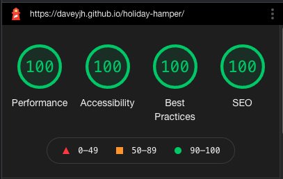
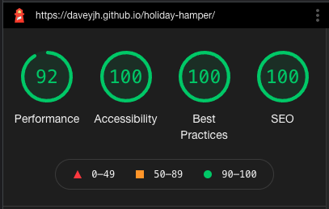

# Holiday Hamper

[Here is a link to the final project](https://daveyjh.github.io/holiday-hamper/)

This site was built by team Happy Holiday Hackers for the [Code Institute](https://codeinstitute.net/) December 2021 Hackathon, with the theme of Happy Holidays. It was built to be a resource for information on holidays around the globe, from all walks of life and all times of the year. Due to the time constraints of the Hackathon, we will be focusing on the holidays around December for now. It is designed to be responsive on a wide range of devices, whilst also being easy to navigate through.

## Contents

* [User Experience (UX)](#user-experience-(ux))
  * [Initial Discussion](#initial-discussion)
  * [User Stories](#user-stories)

* [Design](#design)
  * [Color Scheme](#color-scheme)
  * [Typography](#typography)
  * [Imagery](#imagery)
  * [Wireframes](#wireframes)
  * [Features](#features)

* [Technologies Used](#technologies-used)
  * [Languages Used](#languages-used)
  * [Frameworks, Libraries & Programs Used](#frameworks-libraries-and-programs-used)

* [Deployment](#deployment)
  * [Initial Deployment](#initial-deployment)
  * [How to Fork it](#how-to-fork-it)
  * [How to Clone it](#how-to-clone-it)
  * [Making a Local Clone](#making-a-local-clone)

* [Testing](#testing)
  * [W3C Validator](#w3c-validator)
  * [Testing User Stories](#testing-user-stories)
  * [Full Testing](#full-testing)
  * [Further Testing](#further-testing)
  * [Solved Bugs](#solved-bugs)
  * [Known Bugs](#known-bugs)
  * [Lighthouse](#lighthouse)
    * [Performance](#performance)
    * [Accessibility](#accessibility)
    * [Best Practices](#best-practices)
    * [SEO](#seo)

* [Credits](#credits)
  * [Code](#code)
  * [Content](#content)
  * [Media](#media)
  * [Acknowledgements](#acknowledgements)

---

## User Experience (UX)

### Initial Discussion

We wanted this project to be as inclusive as possible. As the main holidays in each country are often related to religion, and we wanted to ensure that we were creating a site that was inclusive for people of all faiths, including atheists and agnostics. We wanted to create a resource for information on holidays around the globe, from all walks of life and all times of the year. We discussed the scope of this, and decided that, due to the time contraints of a Hackathon, we'd focus on the holidays that take place around December to start with, with the plan to expand this once the Hackathon has finished. We also want to add an interactive element to encourage education across a wide variety of cultures.

### User Stories

#### First Time Visitor Goals

* Easy to navigate
* Easy to understand the site's purpose
* Find information on different holidays
* Experience surprise and delight moment across the site

#### Returning Visitor Goals

* Find in-depth information on holidays
* Submit a request for a holiday to be added to the site
* See fun facts about the different holidays

[Back to Top](#holiday-hamper)

---

## Design

### Color Scheme

* We have stuck with a fairly minimal colour scheme:
  * Red
  * Yellow
  * Black
  * White
* We chose these colours to link with the festive theme of the site, as red and yellow are often used in celebration.
* Black and white were used to ensure good colour contrast across the site.
* The entire site has a colour contrast that is AA compliant in accordance with the WCAG Colour Contrast Guidelines.

### Typography

* We have used sans-serif fonts throughout the site, except for the header logo text. This is because sans-serif is accessibility friendly, as it is easily readable to users with dyslexia.
* [Dancing Script](https://fonts.google.com/specimen/Dancing+Script) has been used for the header logo text, with a fallback font of sans-serif is used as the default backup font in cases where these fonts have difficulty loading. This font was chosen for it's holiday-feel. We decided to go with a non-sans-serif font for the header logo text, as it's not an important piece of text.

### Imagery

* Most images used on the site are from the specific holiday that they're linked to.
* The holiday pages have a black background with sparkles on it, to link with the festive theme, without requiring a different background for every holiday.
* The favicon is a gift, wrapped in a sparkly blue wrapping paper with a gold bow, to link with the festive theme.
* The site logo was made by our team, which consists of a picnic hamper, with various holiday-related items inside it.

### Wireframes

* [Here are the wireframes for this project](docs/wireframes.pdf).

### Features

* Header
  * Logo / Title
  * Menu icon for quick navigation
  * Constistant throughout site
* Welcome page with fireworks image
  * Individual sparkling stars for links to main content
  * Short text welcome
  * Eye catching and emotive
  * Small margin below for space for down arrow/show content below fold
* Brief section for each holiday
  * Holiday related image
  * Name of holiday and brief info
  * Button linking to main content information
  * Small margin below for space for down arrow/show content below fold
* Full page for each holiday
  * Full details of the holiday
  * Multiple holiday related images
* Send in your holiday form
  * Input fields to retrieve information
  * Using EmailJS to send the form to the dev team
* Footer
  * Constistant throughout site
  * Copyright information
  * Links to holiday-related games

[Back to Top](#holiday-hamper)

---

## Technologies Used

### Languages Used

* [HTML5](https://developer.mozilla.org/en-US/docs/Web/Guide/HTML/HTML5)
* [CSS3](https://developer.mozilla.org/en-US/docs/Archive/CSS3#:~:text=CSS3%20is%20the%20latest%20evolution,flexible%20box%20or%20grid%20layouts.)
* [JavaScript](https://developer.mozilla.org/en-US/docs/Web/JavaScript)

### Frameworks Libraries and Programs Used

#### Font Awesome

[Font Awesome](https://fontawesome.com/) was used to add the icons.

#### Git

Git was used for version control by utilizing the Gitpod terminal to add and commit to Git and push to GitHub.

#### GitHub

GitHub is used to store the code for this project after being pushed from Git.

#### Balsamiq

Balsamiq was used to create the wireframes during the design process.

#### Responsinator

[Responsinator](http://www.responsinator.com/) was used to help improve the responsive design on a variety of devices.

#### Google DevTools

Google DevTools was used to help us find which code correlated to which feature.

#### Am I Responsive Design

[Am I Responsive Design](http://ami.responsivedesign.is/#) was used to check the responsive design of the quiz.

#### Shields.io

[Shields.io](https://shields.io/) was used to create the GitHub badges for this README.md file.

#### Autoprefixer CSS online

[Autoprefixer CSS online](https://autoprefixer.github.io/) was used to ensure all prefixes for browsers were included correctly.

#### Yoksel

[Yoksel](https://yoksel.github.io/url-encoder/) was used to convert the SVG to a background image for the stars.

#### Favicon.io

[Favicon.io](https://favicon.io/) was used to create the favicon for this site.

#### Remove.bg

[Remove.bg](https://www.remove.bg/) was used to remove the background colour of the image that we used in the favicon.

[Back to Top](#title)

---

## Deployment

### Initial Deployment

This site was deployed to GitHub Pages by following these steps:

1. Login or Sign Up to [GitHub](www.github.com).
2. Create a new repository named "holiday-hamper".
3. Once created, click on "Settings" on the navigation bar under the repository title.
4. Scroll down to "Pages".
5. Under "Source", choose which branch to deploy. We chose "main", but this is sometimes shown as "master".
6. Choose which folder to deploy from, usually "/root".
7. Click "Save", then wait for it to be deployed. It can take some time for the page to be fully deployed.
8. Your URL will be displayed above "Source".

### How to Fork it

1. Login or Sign Up to [GitHub](www.github.com).
2. On GitHub, go to [daveyjh/holiday-hamper](https://github.com/Abibubble/holiday-hamper).
3. In the top right, click "Fork".

### How to Clone it

1. Login or Sign Up to [GitHub](www.github.com).
2. Fork the repository daveyjh/holiday-hamper using the steps above in [How to Fork it](#how-to-fork-it).
3. Above the file list, click "Code".
4. Choose if you want to clone using HTTPS, SSH, or GitHub CLI, then click the copy button to the right.
5. Open Git Bash.
6. Change the directory to where you want your clone to go.
7. Type git clone and then paste the URL you copied in step 4.
8. Press Enter to create your clone.

### Making a Local Clone

1. Log in to [GitHub](www.github.com) and locate the [Repository](https://github.com/daveyjh/holiday-hamper) for this site.
2. Under the repository name, above the list of files, click "Code".
3. Here you can either Clone or Download the repository.
4. You should clone the repository using HTTPS, clicking on the icon to copy the link.
5. Open Git Bash.
6. Change the current working directory to the new location, where you want the cloned directory to be.
7. Type git clone, and then paste the URL that was copied in Step 4.
8. Press Enter, and your local clone will be created.

For a more detailed version of these steps, go to the [Github Docs](https://docs.github.com/en/github/creating-cloning-and-archiving-repositories/cloning-a-repository#cloning-a-repository-to-github-desktop) page on this topic.

[Back to Top](#holiday-hamper)

---

## Testing

### W3C Validator

The W3C Markup Validator, W3C CSS Validator and JSHint were used to validate the project to ensure there were no syntax errors within the site.

1. W3C Markup Validator
    * [Landing page](LINK)
    * [Christmas page](LINK)
    * [Diwali page](LINK)
    * [Hanukkah page](LINK)
    * [New Year's Eve page](LINK)
    * [Suggestion form page](LINK)
    * [Yuletide](LINK)
    * [Chinese New Year](LINK)

2. W3C CSS Validator
    * [Landing page](LINK)
    * [Christmas page](LINK)
    * [Diwali page](LINK)
    * [Hanukkah page](LINK)
    * [New Year's Eve page](LINK)
    * [Suggestion form page](LINK)
    * [Yuletide](LINK)
    * [Chinese New Year](LINK)

3. JSHint
    * [JSHint](https://jshint.com/)

[Back to Top](#holiday-hamper)

### Testing User Stories

#### First Time Visitor Goals Testing

##### Easy to navigate

* The navigation menu is accessible by a click of the burger icon in the top right corner.
* Other links to pages on the site can be found under seach small section on the landing page.
* A next holiday arrow is included at the bottom of every minor section on the landing page, to take the user to the next holiday section.

##### Easy to understand the site's purpose

* The first thing that the user sees on the landing page is a description of the purpose of the site.

##### Find information on different holidays

* A short description of each holiday is present on the landing page.
* From each holiday on the landing page, there is a 'More Info' button to take the user to the page dedicated to that holiday.
* There is a fun fact section at the bottom of each dedicated page.

##### Experience surprise and delight moment across the site

* There are stars that sparkle at the top of the landing page. These stars also link to the dedicated holiday pages.
* There is a fun fact section at the bottom of each dedicated page.

#### Returning Visitor Goals Testing

##### Find in-depth information on holidays

* From each holiday on the landing page, there is a 'More Info' button to take the user to the page dedicated to that holiday.
* There is a fun fact section at the bottom of each dedicated page.

##### Submit a request for a holiday to be added to the site

* There is a form that users can use to submit a request to the dev team, to add a new holiday to the site.
* This request is emailed to the dev team, who can then do further research into that holiday, and add it to the site.

##### See fun facts about the different holidays

* There is a fun fact section at the bottom of each dedicated page.

[Back to Top](#holiday-hamper)

### Full Testing

#### Desktop / Laptop

1. Google Chrome
    * All tested and working correctly.

2. Microsoft Edge
    * All tested and working correctly.

3. Mozilla Firefox
    * All tested and working correctly.

4. Internet Explorer
    * All tested and working correctly.

5. Safari
    * All tested and working correctly.

#### Tablet

1. Safari
    * All tested and working correctly.

#### Mobile

1. Google Chrome
    * All tested and working correctly.

2. Safari
    * All tested and working correctly.

3. Samsung Internet
    * All tested and working correctly.

### Further Testing

The website was tested on Google Chrome, Firefox, Internet Explorer, Microsoft Edge, Safari and Samsung Internet browsers.
The website was viewed on a variety of devices, including:

* Custom built desktop PC, running Windows 10
* Acer Aspire V Nitro Laptop, running Windows 10
* Lenovo B51 IntelCore i7 Laptop, running Ubuntu 16.04 LTS
* MacBook Pro (15-inch, 2017), running macOS Catalina
* MacBookAir7,2 (13-inch, 2017)
* iPad 6,11 5th generation, running iOS 10.3
* Amazon Fire tablet 7
* iPhone 7
* iPhone X
* iPhone 12
* OPPO Find X2
* OPPO Find X2 Lite
* Samsung Galaxy A70
* Samsung Galaxy S9
* Samsung Galaxy S10+
* Samsung A20
* xBox One

A large amount of testing was done to ensure that all pages were visible or hidden correctly, all buttons worked as they should, and the site worked as it should.
Friends, family members, and other developers were asked to review the site and documentation to point out any bugs and/or user experience issues that they came across.

[Back to Top](#holiday-hamper)

### Solved Bugs

1. The quiz script was throwing errors on some pages, stating that the JavaScript couldn't find specific elements on the HTML files.
    * We looked at which pages the errors were being thrown on.
    * We realised the errors were appearing on the pages that didn't have the quiz elements being included.
    * We separated the quiz script into a new script file, and only loaded that script on the relevant pages.
    * Whilst fixing this bug, we also discovered that the back to top button was also causing similar errors to show.
    * We did the same thing for the back to top button, creating a separate script file for it.

### Known Bugs

* The randomised star links occasionally overly on the header, navbar, and text.
* The navbar links change hover colour, without being clickable. Only the text is clickable.

### Lighthouse

We tested our website using DevTools Lighthouse feature, and got these results:

#### Desktop Lighthouse

#### Mobile Lighthouse

#### Performance

* EXPLAIN SCORE AND HOW WE IMPROVED IT IF NECESSARY

#### Accessibility

* EXPLAIN SCORE AND HOW WE IMPROVED IT IF NECESSARY

#### Best Practices

* EXPLAIN SCORE AND HOW WE IMPROVED IT IF NECESSARY

#### SEO

* EXPLAIN SCORE AND HOW WE IMPROVED IT IF NECESSARY

[Back to Top](#holiday-hamper)

---

## Credits

### Code

* [Font Awesome](https://fontawesome.com/): Library of icons used for social media and download links.
* [Autoprefixer CSS online](https://autoprefixer.github.io/): To aid in the CSS prefixing.

### Content

* [National Today](https://nationaltoday.com/): various traditions
* [Why Christmas](https://www.whychristmas.com): Christmas traditions
* [iNews](https://inews.co.uk/light-relief/offbeat/yule-what-winter-festival-origins-explained-christmas-celebrations-806267): Christmas traditions
* [Goddess And Greenman](https://www.goddessandgreenman.co.uk/yule/): Yuletide traditions
* [Chinese New Year](https://chinesenewyear.net/21-things-you-didnt-know-about-chinese-new-year/): Chinese New Year traditions
* [The Culture Trip](https://theculturetrip.com/asia/india/articles/15-surprising-facts-you-may-not-know-about-diwali/): Diwali traditions
* [Town And Country Magazine](https://www.townandcountrymag.com/leisure/arts-and-culture/g13787924/hanukkah-facts-history-story/): Hanukkah traditions

### Media

* [Star SVG](https://freesvg.org/simple-star-silhouette)
* [Favicon present image](https://pixabay.com/illustrations/gift-christmas-celebrate-4567561/)
* [Holiday page background image](https://pixabay.com/illustrations/abstract-heart-cover-card-love-4795495/)
* All other images have been taken from [Pexels](https://www.pexels.com/) and [Unsplash](https://unsplash.com/).

### Acknowledgements

* The team at [Code Institute](https://codeinstitute.net/), for teaching us the necessary skills to create this site.
* All members of team Happy Holiday Hackers
  * [Abi Harrison](https://github.com/Abibubble)
  * [Dave Horrocks](https://github.com/daveyjh)
  * [Karol Miles](https://github.com/KarMiles)
  * [Mike Avgeros](https://github.com/MikeAvgeros)
  * [Mateusz Niechwiej](https://github.com/mateuszniechwiej)
  * [Polycarp](https://github.com/Polyanyanwu/)

[Back to Top](#holiday-hamper)
